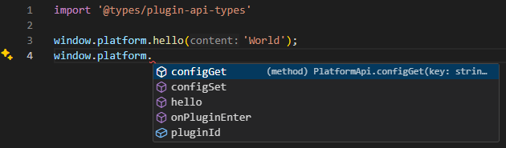

# 插件的平台API类型定义
在使用ts开发我们项目的插件时，可以通过使用本仓库来获取类型提示。


## 开始使用

### 安装
```bash
npm install git+https://github.com/frontend-camp-25-12/plugin-api-types
```

### 引入
```typescript
import '@types/plugin-api-types';
```

### 完成！
现在在window.platform上可以看到类型提示了。

### 更新
平台API会随着开发而更新，可以通过更新npm包来获取最新的类型提示。
```bash
npm update @types/plugin-api-types
```